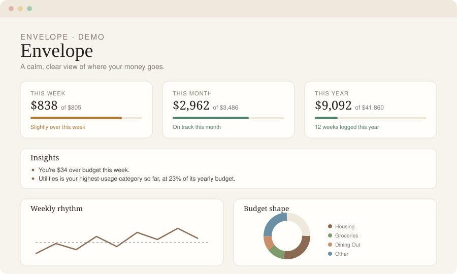

# Envelope

A calm, spreadsheet-powered budget dashboard that runs entirely in your browser.

[](LICENSE)




*(The image above is an illustration of the layout, not a screenshot — open `index.html` to see the real thing.)*

## Why Envelope

Most budgeting apps want an account, a bank connection, and a subscription. Envelope wants none of that. You keep your budget in a plain Excel workbook — the format you already know — and this page reads it, entirely on your device, and turns it into something calmer and easier to scan than a spreadsheet. Nothing is uploaded, tracked, or stored anywhere but your own browser session.

It's three files (`index.html`, `styles.css`, `script.js`) and one spreadsheet. No accounts, no build step, no server.

## Features

- **This week / this month / this year** overview cards with progress bars and plain-language status
- **Auto-generated insights** — under/over budget this week and month, a pace projection for the year, and your highest-usage category
- **Weekly rhythm** line chart of recent weeks against your weekly budget
- **Budget shape** donut chart showing how your weekly budget is allocated
- **Budget vs actual** bar chart and ranked category list, both switchable between Week / Month / Year with a single toggle
- Fully responsive, from phone to desktop
- Reads any workbook that matches the schema below — your categories, your numbers
- **Blank template download** — a zeroed-out copy of the workbook to fill in, so you never have to touch the sample data to get your own version

## Quick start

Browsers block a page from `fetch`-ing a local file directly, so run a tiny local server rather than double-clicking `index.html`:

```bash
git clone https://github.com/<your-username>/envelope-budget.git
cd envelope-budget
python3 -m http.server 8000
```

Then open `http://localhost:8000`. You'll see the dashboard populated with the fictional data in `sample-budget.xlsx`.

To use your own numbers, either:
- replace `sample-budget.xlsx` with your own file (same name), or
- click **Open your workbook** and pick a file — it's read locally in your browser and never saved or uploaded, or
- click **Download blank template** for a copy of `blank-template.xlsx` — same sheets, same categories, all numbers zeroed and no weeks logged — fill it in and open it with **Open your workbook**.

Either way, nothing is ever actually *uploaded* anywhere — "Open your workbook" just points the browser's file reader at a local file. Envelope re-reads whatever you hand it each time; it doesn't keep a live link to the file on disk, so if you edit the spreadsheet afterward you'll need to pick it again to refresh the page (see note below).

## Workbook schema

Envelope expects two sheets. Category names can include emoji (`🏠 Housing`) — they're stripped automatically — and must match exactly between the two sheets.

**`Budget`**

| Category | Weekly | Monthly | Yearly |
|---|---|---|---|
| Housing | 350 | 1515.5 | 18200 |
| Groceries | 90 | 389.7 | 4680 |
| … | … | … | … |
| TOTAL | 805 | 3485.65 | 41860 |

**`Weekly Log`**

| Week | Housing | Groceries | … | Weekly Total |
|---|---|---|---|---|
| W1 | 340 | 82.5 | … | 812.10 |
| W2 | 350 | 95.2 | … | 790.40 |

Add as many category columns as you like — the site only looks at columns whose header matches a category on the `Budget` sheet, plus a `Weekly Total` column (or it sums the category columns itself if that's missing).

A blank cell or `0` in every category column for a week means that week hasn't been logged yet, so it's excluded from the "weeks logged" count and the charts.

**How much can your workbook differ from the template?** The sheets must be named exactly `Budget` and `Weekly Log` — those two lookups are hardcoded in `parseWorkbook()`. Within that, Envelope is forgiving:
- Renaming, adding, or removing categories works — the `Weekly Log` header row is matched to `Budget` category names at load time, not hardcoded.
- Emoji, extra spacing, and capitalization in category names are normalized away before matching.
- A missing `Weekly Total` column is fine (it gets summed from the category columns instead).
- An unrecognized category still gets a color from the fallback palette, so it won't look broken.

What it won't tolerate: different sheet names, or a `Budget` sheet whose first four columns aren't Category / Weekly / Monthly / Yearly in that order (those are read positionally, not by header). If either sheet is missing, Envelope shows a clear error rather than guessing.

**No live refresh.** "Open your workbook" reads the file once, at the moment you pick it — there's no ongoing link to the file on disk. Edit the spreadsheet again and you'll need to click **Open your workbook** and re-select it to see the update; the browser's file-picker API doesn't hand out a live handle you can silently re-read. (A browser-only workaround exists — the File System Access API lets a page keep a reusable handle to a chosen file, Chrome/Edge only, not Safari/Firefox — but Envelope doesn't use it today.)

## Deploying with real data — please read this

Envelope has no login and no server: whatever workbook sits next to `index.html` is visible to **anyone who has the URL**, the moment it's deployed. That's fine for a sample or a demo. It is not fine for your real finances.

If you want to use this with your own budget:

- **Safest**: run it locally only (the Quick start steps above), or keep the repository and any hosting private.
- **If you do deploy publicly**: put the site behind authentication (most static hosts — Vercel, Netlify, Cloudflare Pages — offer password protection on free tiers), and don't commit your real workbook to a public repository.
- **Never commit your real spreadsheet.** Even if you delete a file later, it stays in git history unless you rewrite it. Keep your real file named to match a pattern in `.gitignore` (`*.local.xlsx`, `budget.xlsx`, `my-budget.xlsx` are ignored already), or skip committing it entirely and load it each session with **Open your workbook** instead.

## Tech stack

- [SheetJS](https://sheetjs.com/) — reads `.xlsx` in the browser
- [Chart.js](https://www.chartjs.org/) — the three charts
- Vanilla HTML/CSS/JS — no framework, no bundler, no dependencies to install
- [Fraunces](https://fonts.google.com/specimen/Fraunces) + [Inter](https://fonts.google.com/specimen/Inter) via Google Fonts

## Customizing

- **Categories & colors** — edit `CATEGORY_COLORS` near the top of `script.js`. Categories not listed there fall back to a rotating palette, so custom workbooks work out of the box.
- **Currency** — the `money()` helper in `script.js` uses `en-US` / `USD`; change the locale and currency code there.
- **Palette & type** — everything lives in the `:root` custom properties at the top of `styles.css`.
- **Sheet names** — if your workbook uses different sheet names, update the two lookups near the top of `parseWorkbook()` in `script.js`.

## Contributing

Issues and pull requests are welcome — bug fixes, accessibility improvements, and small, focused features that keep the spirit of the project (calm, minimal, client-side only) are especially appreciated.

## License

MIT — see [LICENSE](LICENSE).
